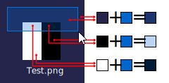

# Introduction
This document aims to explain how to calculate the RGB and Alpha components of
every pixel of an overlay.

# Examples
1. Selecting something on Windows Desktop. There are two colors here:
    - the *border* of the selection rectangle, which is trivial since it's just 
      a solid color (${\color{#0078D7}\blacksquare}$ `#0078D7`)
    - the actual fill of the selection rectangle itself, which is of interest.
      With this program, I have calculated the color, which is
      ${\color{#0066CC}\blacksquare}$ `#0066CC46` (i.e. with an Alpha of $70$)!

    Example: 

2. Selecting something in an Office product, like PowerPoint. (*TODO*)

3. Removing video editor watermarks.

# Variables
These are the **inputs**:
- $B$ = background i.e. **original** component *(integer from* $0$ *to* $255$, *inclusive)*
- $R$ = **resulting** component *(integer from* $0$ *to* $255$, *inclusive)*

These are the **outputs**:
- $a$ = alpha of the overlay *(fractional number from* $0$ *to* $1$, *inclusive)*
- $h$ = component of the overlay *(integer from* $0$ *to* $255$, *inclusive)*

# Derivation
Let's now derive the equation. We start with the equation for mixing of two
colors.
$$ (1-a)B + ah = R $$

We need to get an equation for $a$ and $h$, in terms of $B$ and $R$.

$$
\begin{align*}
(1-a)B + ah  &=  R\\
B - Ba + ah  &=  R\\
-Ba + ah     &=  R - B\\
a(h - B)     &=  R - B\\
a            &=  \dfrac{R - B}{h - B}\\
\end{align*}
$$

$$
\begin{align*}
a &= \dfrac{R_{1} - B_{1}}{h - B_{1}}\\
a &= \dfrac{R_{2} - B_{2}}{h - B_{2}}\\
\end{align*}
$$

$$
\begin{align*}
\dfrac{R_{1} - B_{1}}{h - B_{1}} &= \dfrac{R_{2} - B_{2}}{h - B_{2}}\\
(R_{1} - B_{1})(h - B_{2}) &= (R_{2} - B_{2})(h - B_{1})\\
R_{1}h - B_{1}h - R_{1}B_{2} + B_{1}B_{2} &= R_{2}h - B_{2}h - R_{2}B_{1} + B_{1}B_{2}\\
R_{1}h - B_{1}h - R_{1}B_{2} &= R_{2}h - B_{2}h - R_{2}B_{1}\\
(R_{1} - B_{1})h - R_{1}B_{2} &= (R_{2} - B_{2})h - R_{2}B_{1}\\
(R_{1} - B_{1})h - (R_{2} - B_{2})h &= R_{1}B_{2} - R_{2}B_{1}\\
(R_{1} - B_{1} - R_{2} + B_{2})h &= (R_{1}B_{2} - R_{2}B_{1})\\
h &= \dfrac{R_{1}B_{2} - R_{2}B_{1}}{(R_{1} - B_{1}) - (R_{2} - B_{2})}
\end{align*}
$$
